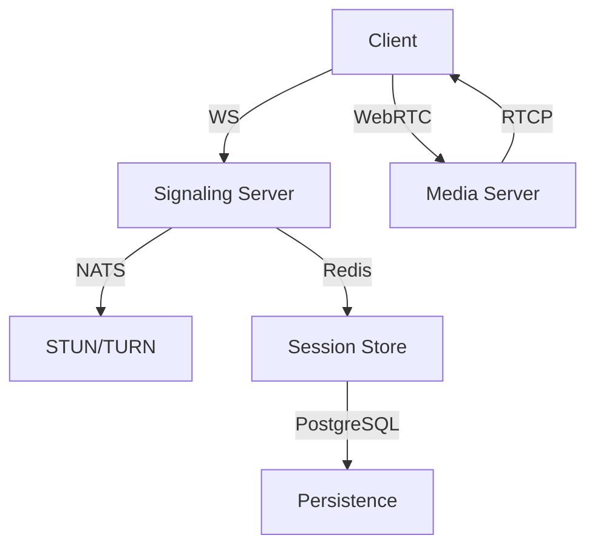
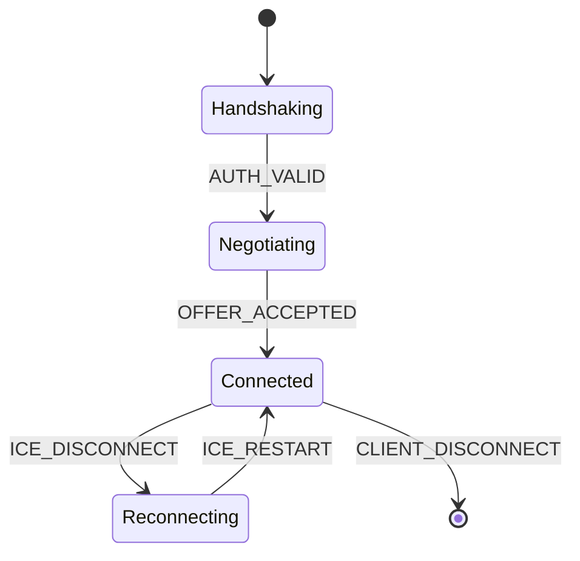
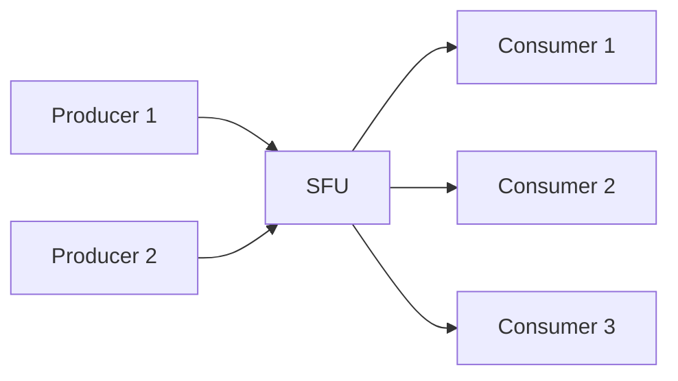
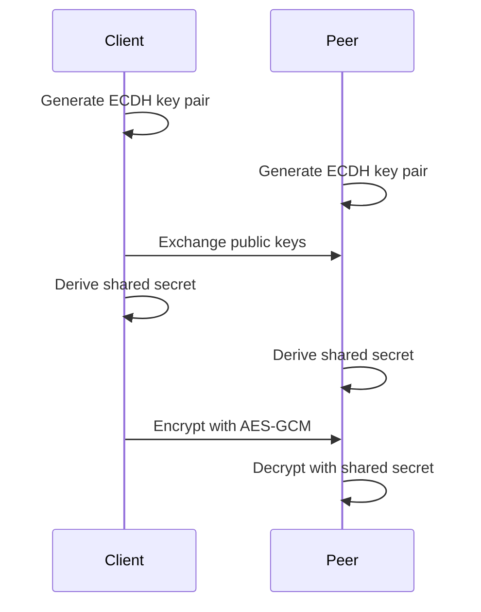
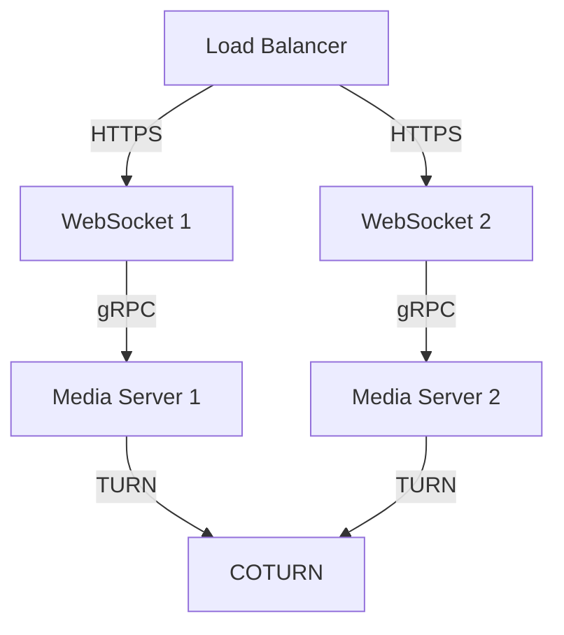

# Real-Time Communication Platform Architecture



## 1. Core Architecture

### 1.1 System Components
| Component              | Technology          | Responsibility                          |
|------------------------|---------------------|------------------------------------------|
| Signaling Server       | Socket.IO Cluster   | Session negotiation & presence tracking  |
| Media Router           | mediasoup           | SFU media distribution                   |
| ICE Servers            | coturn             | NAT traversal & relay fallback           |
| Session Store          | Redis               | Ephemeral session data                   |
| Persistent Store       | PostgreSQL          | User accounts & audit logs               |
| Monitoring             | Prometheus+Grafana | Real-time metrics collection             |

### 1.2 Data Flow
```typescript
sequenceDiagram
    participant C1 as Client A
    participant S as Signaling
    participant M as MediaServer
    participant C2 as Client B
    
    C1->>S: JOIN_ROOM
    S->>M: Allocate transport
    M-->>S: Transport info
    S-->>C1: ROUTER_CAPABILITIES
    C1->>M: CONNECT_TRANSPORT
    C1->>M: PRODUCE_MEDIA
    M-->>C2: NEW_PRODUCER
    C2->>M: CONSUME_MEDIA
```

## 2. Signaling Mechanism

### 2.1 Event Taxonomy


### 2.2 Message Protocol
```protobuf
message Signal {
  string version = 1;
  oneof payload {
    Offer offer = 2;
    Answer answer = 3;
    Candidate candidate = 4;
    Error error = 5;
  }
  
  message Offer {
    string sdp = 1;
    repeated string ice_ufrag = 2;
  }
}
```

## 3. Media Handling

### 3.1 Peer Connection Lifecycle
```typescript
interface PeerConnection {
  createOffer(): Promise<RTCSessionDescription>;
  setLocalDescription(desc: RTCSessionDescription): void;
  addIceCandidate(candidate: RTCIceCandidate): void;
  createDataChannel(label: string): RTCDataChannel;
  close(): void;
}
```

### 3.2 SFU Architecture


### 3.3 Codec Negotiation
```yaml
# config/media.yml
video:
  codecs:
    - name: VP8
      priority: 100
    - name: H264
      priority: 50
  scalabilityMode: "L3T3"
audio:
  opus:
    stereo: true
    dtx: false
```

## 4. Data Channels

### 4.1 File Transfer Protocol
```typescript
interface FileChunk {
  id: string;
  sequence: number;
  total: number;
  data: ArrayBuffer;
  checksum: string;
}

interface FileMetadata {
  name: string;
  type: string;
  size: number;
  lastModified: number;
}
```

### 4.2 Presence System
```graphql
type PresenceEvent {
  userId: ID!
  state: PresenceState!
  timestamp: DateTime!
}

enum PresenceState {
  ACTIVE
  IDLE
  AWAY
}
```

## 5. Security Architecture

### 5.1 E2EE Implementation


### 5.2 Access Control
```rust
// Pseudocode for token validation
fn validate_token(token: JWT) -> Result<Session, Error> {
    let claims = decode_jwt(token)?;
    verify_timestamp(claims.exp)?;
    verify_signature(claims)?;
    check_room_permissions(claims.room_id)?;
    Ok(Session::from(claims))
}
```

## 6. State Management

### 6.1 Zustand Store Structure
```typescript
// src/stores/useCallStore.ts
interface CallState {
  // WebRTC management
  peers: Map<string, Peer>;
  addPeer: (peerId: string, peer: Peer) => void;
  removePeer: (peerId: string) => void;
  
  // Media state
  localStream: MediaStream | null;
  remoteStreams: MediaStream[];
  
  // Data channels
  fileTransfers: Map<string, FileTransfer>;
}

export const useCallStore = create<CallState>()(...);
```

## 7. Performance Considerations

### 7.1 ICE Restart Strategy
```typescript
function handleIceFailure() {
  const restartConfig = {
    iceServers: getUpdatedIceServers(),
    iceTransportPolicy: 'relay' as const,
  };
  
  peer.restartIce(restartConfig);
  monitorConnectionQuality();
}
```

### 7.2 Monitoring Metrics
```bash
# WebRTC Stats
pc.getStats().then(stats => {
  const inbound = stats.find('inbound-rtp');
  console.log('Jitter:', inbound.jitter);
  console.log('Packet Loss:', inbound.packetsLost / inbound.packetsReceived);
});
```

## 8. Deployment Architecture

### 8.1 Server Topology


### 8.2 CI/CD Pipeline
```yaml
# .github/workflows/deploy.yml
name: Production Deploy

on:
  push:
    branches: [main]

jobs:
  deploy:
    runs-on: ubuntu-latest
    steps:
      - uses: actions/checkout@v4
      - uses: pnpm/action-setup@v2
      - run: pnpm install --frozen-lockfile
      - run: pnpm build
      - uses: amondnet/vercel-action@v3
        with:
          vercel-token: ${{ secrets.VERCEL_TOKEN }}
          vercel-org-id: ${{ secrets.VERCEL_ORG_ID }}
          vercel-project-id: ${{ secrets.VERCEL_PROJECT_ID }}
```

## 9. Cross-Cutting Concerns

### 9.1 Logging Strategy
```typescript
interface LogEntry {
  timestamp: number;
  level: 'debug' | 'info' | 'warn' | 'error';
  context: {
    roomId?: string;
    userId?: string;
    peerId?: string;
  };
  message: string;
  error?: Error;
}
```

### 9.2 Error Handling
```typescript
class WebRTCError extends Error {
  constructor(
    public code: 'ICE_FAILURE' | 'SDP_NEGOTIATION',
    message: string
  ) {
    super(message);
    Object.setPrototypeOf(this, WebRTCError.prototype);
  }
  
  toJSON() {
    return {
      code: this.code,
      message: this.message,
      stack: this.stack
    };
  }
}
```

## 10. Glossary

| Term          | Definition                                  |
|---------------|--------------------------------------------|
| SDP           | Session Description Protocol               |
| ICE           | Interactive Connectivity Establishment    |
| STUN          | Session Traversal Utilities for NAT       |
| TURN          | Traversal Using Relays around NAT         |
| SFU           | Selective Forwarding Unit                 |
| E2EE          | End-to-End Encryption                     |
| DTLS          | Datagram Transport Layer Security         |
```

This architecture document provides:

1. Detailed component interaction diagrams
2. Protocol buffer definitions for signaling
3. Media server configuration examples
4. Cryptographic implementation details
5. State management patterns
6. Failure recovery strategies
7. Deployment topologies
8. Error classification system
9. Comprehensive glossary

The document uses Mermaid diagrams for visual explanations and includes protocol-level details critical for understanding the low-level implementation. It maintains technical precision while providing multiple entry points for different contributor roles (backend, frontend, DevOps).