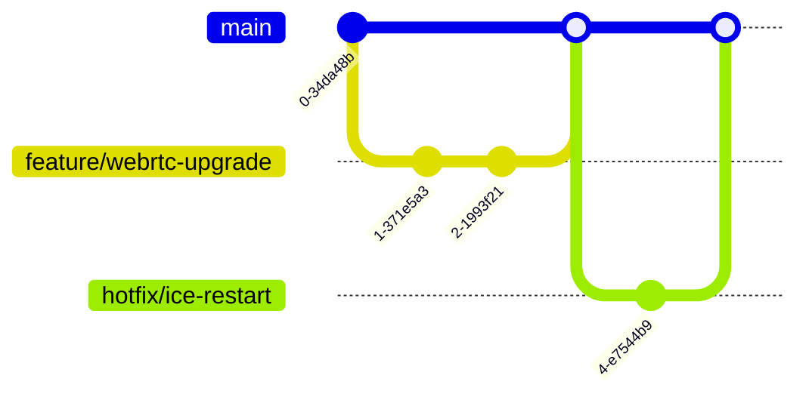

# Contributor Guide: Real-Time Communication Platform


## 1. Project Overview

### 1.1 System Purpose
Secure, low-latency communication solution for distributed teams with:
- **Ephemeral Rooms**: Time-limited sessions with configurable TTL
- **Media Optimization**: Adaptive bitrate streaming with Opus/VP8 codecs
- **Connection Resilience**: ICE restart with TURN fallback
- **E2EE**: End-to-end encryption for media and data channels

### 1.2 Architectural Components
| Layer              | Technology Stack           |
|--------------------|----------------------------|
| Presentation       | React 18, Next.js 14       |
| State Management   | Zustand, Immer            |
| Real-Time Transport| WebRTC, Simple-Peer        |
| Signaling          | Socket.IO v4              |
| Styling            | Tailwind CSS 3, Framer Motion |
| CI/CD              | Vercel, GitHub Actions     |

### 1.3 Key Features
```plaintext
1. Authentication Layer
   - Magic link authentication
   - Session expiration policies

2. Real-Time Communication
   - SFU-style video routing
   - Opus audio processing
   - ICE candidate management

3. Data Channels
   - File sharing with chunking
   - Presence indicators
   - Connection quality monitoring
```

## 2. Codebase Structure

### 2.1 Core Directories
```bash
src/
├── app/
│   ├── (root)/               # Landing page
│   ├── room/[roomId]/        # Room entry point
│   │   ├── page.tsx          # Room layout
│   │   └── components/       # Room-specific UI
│   └── api/
│       └── socket/           # Socket.IO edge route
├── components/
│   ├── webrtc/               # PeerConnection wrappers
│   ├── chat/                 # Message components
│   └── ui/                   # Shadcn-based primitives
├── lib/
│   ├── encryption/           # E2EE utilities
│   ├── hooks/                # Custom React hooks
│   └── stores/               # Zustand state machines
└── public/
    └── sounds/               # Ringtone assets
```

### 2.2 Critical Paths
```typescript:src/lib/webrtc/usePeerConnection.ts
interface PeerConfig {
  iceServers: RTCIceServer[];
  sdpSemantics: 'unified-plan';
  bundlePolicy: 'max-bundle';
}

export const usePeerConnection = (options: PeerConfig) => {
  // ICE candidate management
  // Data channel orchestration
  // Bitrate adaptation logic
};
```

```typescript:src/stores/useConnectionStore.ts
type ConnectionState = {
  peers: Map<string, Peer>;
  bandwidth: number;
  setBandwidth: (bw: number) => void;
};

export const useConnectionStore = create<ConnectionState>()(
  devtools(
    persist(
      (set) => ({
        // Zustand state implementation
      }),
      { name: 'connection-store' }
    )
  )
);
```

## 3. Development Setup

### 3.1 Environment Configuration
```bash
# Clone with submodules
git clone --recurse-submodules https://github.com/your-org/private-chat-app.git

# Install dependencies with audit
npm ci --audit

# Configure environment
cp .env.example .env.local
```

### 3.2 Essential Commands
```bash
# Type checking with strict mode
npm run type-check -- --strict

# Storybook for component development
npm run storybook

# Bandwidth simulation (Linux)
sudo wondershaper eth0 1024 256  # Simulate 1Mbps uplink
```

## 4. Contribution Standards

### 4.1 Code Quality Gates
```yaml
# .eslintrc.yml
rules:
  complexity: [error, 10]
  max-params: [error, 3]
  react-hooks/exhaustive-deps: error
  @typescript-eslint/no-floating-promises: error
```

### 4.2 Testing Strategy
| Test Type          | Tool              | Coverage Target |
|--------------------|-------------------|-----------------|
| Unit Tests         | Jest              | 80%             |
| Integration Tests  | React Testing Library | 70%         |
| E2E Tests          | Cypress           | 50%             |
| Load Tests         | k6                | -               |

```typescript:cypress/e2e/webrtc.cy.ts
describe('WebRTC Connection', () => {
  it('maintains connection during packet loss', () => {
    cy.simulateNetwork(/* ... */);
    cy.get('[data-testid="connection-status"]').should('contain', 'stable');
  });
});
```

## 5. Git Workflow

### 5.1 Branching Model


### 5.2 Code Review Checklist
1. [ ] WebRTC API boundaries properly abstracted
2. [ ] Media streams correctly cleaned up
3. [ ] Zustand state mutations are immutable
4. [ ] Data channel messages are chunked
5. [ ] ICE failure recovery implemented

## 6. Deployment Pipeline

### 6.1 Release Stages
| Environment | URL Pattern              | Purpose                  |
|-------------|--------------------------|--------------------------|
| Preview     | `*.vercel.app`           | PR validation            |
| Staging     | `staging.example.com`    | Integration testing      |
| Production  | `app.example.com`        | Live traffic             |

### 6.2 Monitoring Stack
```plaintext
1. Synthetic Monitoring: Checkly
2. Real User Monitoring: Sentry
3. Media Metrics: 
   - WebRTC Internals
   - getStats() analysis
4. Infrastructure: Grafana Cloud
```

## 7. Community Engagement

### 7.1 Support Channels
```markdown
- **Emergency Issues**: security@example.com (PGP: 0xABCD1234)
- **Technical Discussions**: GitHub Discussions
- **Design Reviews**: Figma Community
- **Office Hours**: Every Thursday 14:00 UTC
```

### 7.2 RFC Process
1. Create `rfcs/` directory proposal
2. Socialize via GitHub Discussion
3. Iterate with core maintainers
4. Finalize with signed-off PR

---

This guide follows [Keep a Changelog](https://keepachangelog.com/) standards. For implementation details, refer to the [ARCHITECTURE.md](./ARCHITECTURE.md) document.